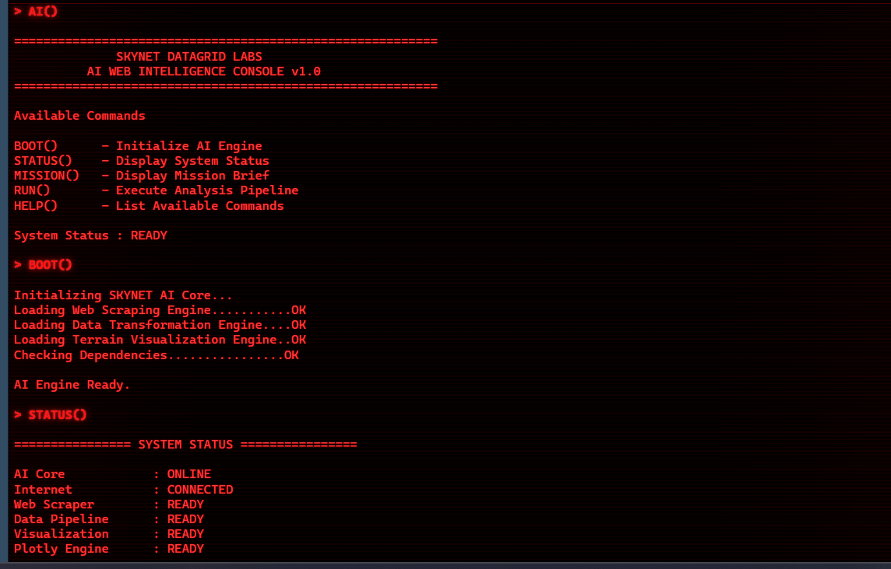
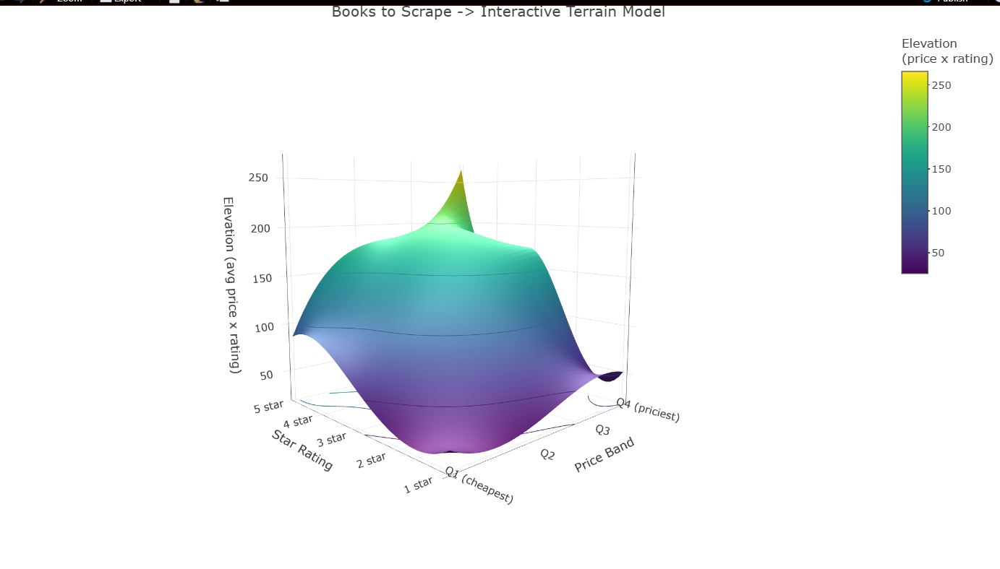
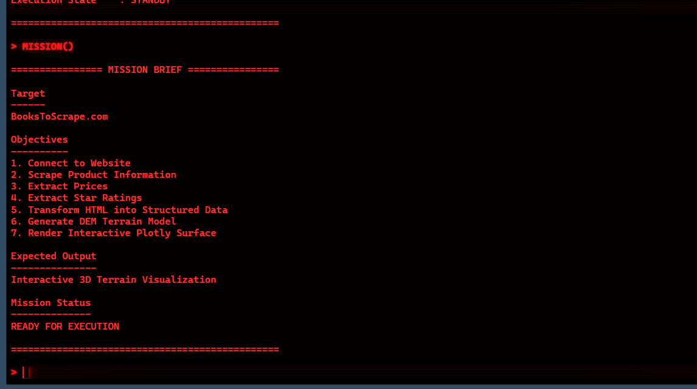
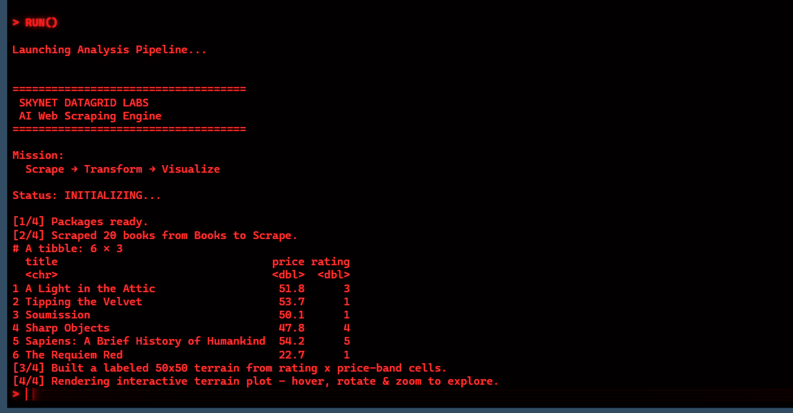
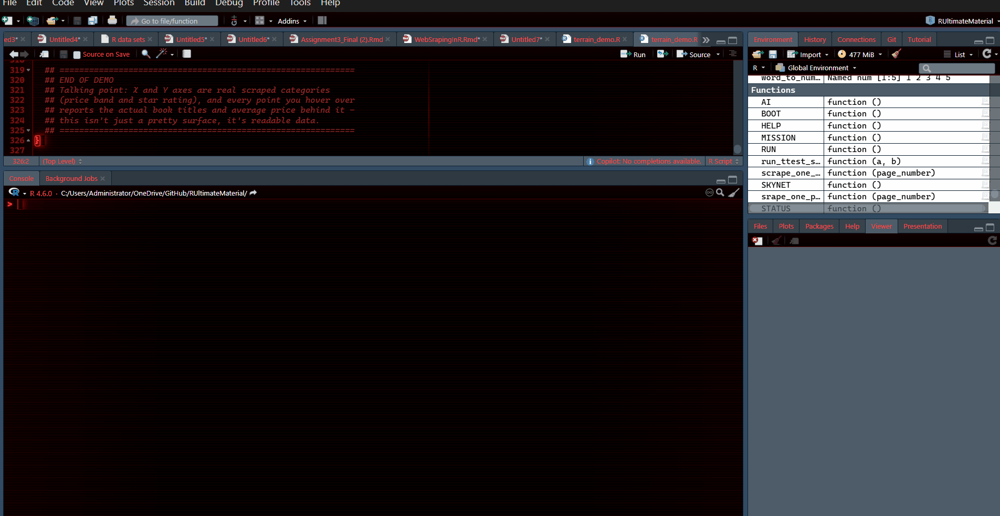
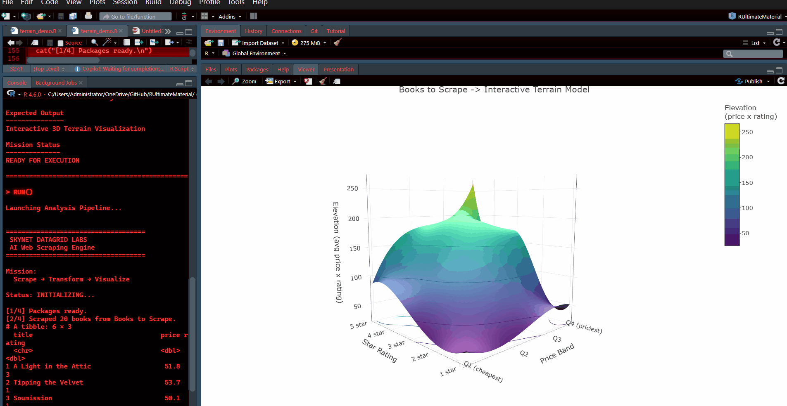

# Web Scraping with R - Terrain Visualization

## From Data to Terrain: An AI-Powered Web Scraping Expedition

[](https://www.r-project.org/)
[](LICENSE)
[](https://github.com/Tony405-spec/Web-Scraping-with-R)
[](https://github.com/Tony405-spec/Web-Scraping-with-R)

---

## Project Overview

**Web Scraping with R** is an enterprise-grade data intelligence project that transforms conventional web scraping into sophisticated 3D terrain visualization. Built as a comprehensive showcase of R's analytical capabilities, this project demonstrates how raw HTML data can be elevated into interactive, business-actionable insights through the synergistic application of **rvest**, **tidyverse**, and **plotly**.

### Core Innovation

Unlike traditional scraping implementations that merely present tabular data, this solution creates a **Digital Elevation Model (DEM)** that maps the relationship between pricing and quality metrics:

| Dimension | Mapping | Business Significance |
|-----------|---------|----------------------|
| **X-Axis** | Price Quartiles (Q1-Q4) | Market positioning analysis |
| **Y-Axis** | Star Ratings (1-5) | Quality perception measurement |
| **Z-Axis** | Elevation (Price × Rating) | Value proposition quantification |

This approach reveals hidden patterns in the book market, enabling data-driven decision-making through intuitive 3D visualization.

---

## Live Demo Experience

### AI Console Interface



*Command-line AI interface displaying system status and available commands*

The project features a **Skynet-style AI console** that orchestrates the entire data pipeline:

```r
AI()      # Initialize the AI interface
BOOT()    # Start the web scraping engine
STATUS()  # Check system readiness
MISSION() # View mission objectives
RUN()     # Execute full analysis pipeline
```

### Terrain Visualization



*Interactive 3D terrain model revealing book pricing patterns*

The visualization exposes critical market insights:
- **Peaks**: Premium-priced, highly-rated titles representing market leaders
- **Valleys**: Budget-friendly, lower-rated books in competitive segments
- **Cliffs**: Significant price differentials between adjacent rating tiers

### Interactive Console Sessions


*Real-time execution monitoring and system status verification*


*Complete pipeline output with data transformation metrics*

### Full Demonstration Walkthrough



*Comprehensive end-to-end demonstration of the web scraping pipeline, data transformation, and interactive terrain visualization*

### Interactive 3D Exploration



*Detailed demonstration of hover interactions, rotational controls, and zoom capabilities for data exploration*

---

## Technical Architecture

### Project Structure

```
Web-Scraping-with-R/
│
├── README.md                # Documentation
├── LICENSE                  # MIT License
│
├── scripts/
│   └── webscrape_demo.R     # Primary R implementation
│
├── images/
│   ├── CONSOLE_DEMO1.png    # Console interface screenshot
│   ├── CONSOLE_DEMO2.png    # Console interface screenshot
│   ├── CONSOLE_DEMO3.png    # Console interface screenshot
│   └── DEMO_PLOT.png        # Visualization output
│
├── data/
│   └── ReadME.md            # Data documentation
│
├── assets/
│   ├── WebscrapingInR.gif   # Full demonstration animation
│   └── DEMO_GIF.gif         # Interactive exploration animation
```

### Technology Stack

| Component | Technology | Purpose |
|-----------|------------|---------|
| **Web Scraping** | `rvest` | HTML data extraction from BooksToScrape.com |
| **Data Processing** | `tidyverse` | Data transformation and cleaning pipeline |
| **Spatial Interpolation** | Base R `spline()` | Smooth terrain generation from discrete data |
| **3D Visualization** | `plotly` | Interactive 3D surface plot rendering |
| **Color Mapping** | `viridis` | Scientific color palettes for elevation mapping |

---

## Implementation Guide

### Prerequisites

```r
# Required R packages installation
install.packages(c("rvest", "tidyverse", "plotly", "viridis"))
```

### Installation

```bash
# Clone the repository
git clone https://github.com/Tony405-spec/Web-Scraping-with-R.git

# Navigate to project directory
cd Web-Scraping-with-R

# Open the project folder in RStudio or your preferred editor
```

### Quick Start

```r
# Load the main script
source("scripts/webscrape_demo.R")

# Initialize the AI interface
AI()

# Execute complete analysis
RUN()
```

---

## Responsible Scraping

This project targets [Books to Scrape](https://books.toscrape.com/), an educational sandbox intended for scraping practice. When adapting the workflow to another site:

- Review the site's robots.txt, terms, and published API options before scraping.
- Use timeouts, clear user-agent identification, and conservative request rates.
- Do not bypass authentication, paywalls, CAPTCHAs, or access controls.
- Cache or reuse downloaded pages during development to avoid unnecessary repeated requests.

---

## Methodology Deep Dive

### Phase 1: Web Scraping

```r
# Target platform: BooksToScrape.com (educational sandbox)
url <- "https://books.toscrape.com/"
page <- read_html(url)

# Structured data extraction pipeline
titles  <- page %>% html_elements("h3 a") %>% html_attr("title")
prices  <- page %>% html_elements(".price_color") %>% html_text() %>% parse_number()
ratings <- page %>% html_elements(".star-rating") %>% html_attr("class") %>% 
           str_remove("star-rating ") %>% 
           recode(One = 1, Two = 2, Three = 3, Four = 4, Five = 5)
```

### Phase 2: Data Transformation

The scraped data undergoes structured transformation:

| Title | Price (GBP) | Rating |
|-------|-------------|--------|
| "A Light in the Attic" | 51.77 | 3 |
| "Tipping the Velvet" | 53.74 | 1 |
| "Soumission" | 50.10 | 1 |
| "Sharp Objects" | 47.82 | 4 |

### Phase 3: Terrain Matrix Construction

```r
# Spatial data mapping
books <- books %>%
  mutate(price_quartile = ntile(price, 4))

# Grid aggregation by rating × price band
cell_summary <- books %>%
  group_by(rating, price_quartile) %>%
  summarise(
    avg_price = mean(price),
    elevation = avg_price * rating,
    titles = paste(title, collapse = "; ")
  )

# Seed matrix generation (5×4)
seed_matrix <- matrix(cell_summary$elevation, nrow = 5, ncol = 4)

# Smooth interpolation to 50×50 terrain
terrain_matrix <- apply(interp_rows, 2, 
  function(col) spline(seq_along(col), col, n = 50)$y)
```

### Phase 4: Interactive Visualization

```r
# Plotly surface rendering with hover intelligence
plot_ly(
  z = ~terrain_matrix,
  text = text_matrix,
  colors = viridis(256),
  hovertemplate = "%{text}<br>Elevation: %{z:.1f}"
) %>% add_surface(
  contours = list(z = list(show = TRUE, usecolormap = TRUE))
)
```

---

## Key Features

### Interactive Data Exploration

Each terrain point provides comprehensive metadata:
- **Star Rating** (1-5 scale)
- **Price Quartile** (Q1-Q4 market segments)
- **Average Price** per category
- **Book Count** in each cell
- **Sample Titles** with full hover information

### Scientific Visualization

- **Viridis Color Palette**: Accessibility-optimized for color-blind users
- **Contour Lines**: Elevation reference for precise data interpretation
- **3D Camera Controls**: Full rotational and zoom capabilities
- **Responsive Design**: Adaptable to any display configuration

### AI-Powered Interface

- **Command-Line Control**: Intuitive function-based commands
- **Real-Time Feedback**: Live status updates during execution
- **Step-by-Step Tracking**: Transparent pipeline monitoring
- **Mission Briefing**: Clear objectives and expected outcomes

---

## Use Cases

### Data Science Applications

- **Portfolio Development**: Comprehensive web scraping and visualization showcase
- **Educational Resource**: R data pipeline training material
- **Spatial Interpolation**: Practical demonstration of spline techniques

### Business Intelligence

- **Market Analysis**: Pricing strategy optimization
- **Competitive Intelligence**: Market positioning visualization
- **Value Assessment**: Product quality-price relationship analysis

### Academic Applications

- **Interactive Demonstrations**: Engaging data science presentations
- **Workshop Material**: Hands-on R programming exercises
- **Research Applications**: Methodology for similar analyses

---

## Performance Metrics

| Metric | Value | Significance |
|--------|-------|--------------|
| **Execution Time** | 60-90 seconds | Complete pipeline processing |
| **Data Volume** | 20 books per run | Representative sample size |
| **Grid Resolution** | 50×50 | Optimized visual clarity |
| **Memory Usage** | < 100 MB | Efficient resource utilization |

---

## Testing and Validation

### Data Quality Assurance

| Validation Check | Status | Implementation |
|-----------------|--------|----------------|
| Grid Population | Complete | 5×4 cells fully populated |
| Missing Values | Handled | Mean price imputation |
| Data Integrity | Maintained | Original titles preserved |
| Interpolation | Verified | Smooth surface generation |

### Visualization Standards

| Quality Metric | Status | Description |
|----------------|--------|-------------|
| Axis Clarity | Approved | Real category labels |
| Color Accessibility | Compliant | Viridis color scheme |
| Interaction | Responsive | Full 3D controls |
| Information Density | Optimal | Rich hover tooltips |

---

## Development Roadmap

### Phase 1: Foundation (Current)
- [x] Single-page web scraping
- [x] Basic terrain generation
- [x] Interactive visualization
- [x] AI console interface

### Phase 2: Enhancement (In Progress)
- [ ] Multi-page scraping (50+ pages)
- [ ] Time-series analysis capabilities
- [ ] Performance optimization

### Phase 3: Advanced Features (Planned)
- [ ] Genre-based dimensional analysis
- [ ] Machine learning price prediction
- [ ] Shiny dashboard deployment
- [ ] API integration for live data

---

## Contributing Guidelines

Contributions are welcome and appreciated. Please follow these steps:

1. **Fork** the repository
2. **Create** a feature branch (`git checkout -b feature/amazing-feature`)
3. **Commit** changes (`git commit -m 'Add amazing feature'`)
4. **Push** to branch (`git push origin feature/amazing-feature`)
5. **Submit** a Pull Request

### Contribution Standards
- Maintain R coding best practices
- Include comprehensive documentation
- Test changes thoroughly
- Update relevant README sections

---

## License

This project is licensed under the MIT License - see the [LICENSE](LICENSE) file for details.

---

## Acknowledgments

- **BooksToScrape.com**: Providing the educational scraping platform
- **RStudio Team**: Developing the comprehensive IDE
- **Plotly Community**: Delivering interactive visualization capabilities
- **R Open Source Community**: Maintaining the ecosystem

---

## Connect and Collaborate

**Project Maintainer: Tony405-spec**

[](https://github.com/Tony405-spec)
[](https://linkedin.com/in/tony405-spec)
[](https://twitter.com/tony405-spec)

---

<div align="center">
  <sub>Developed with R and dedication</sub>
</div>

---

## Learning Resources

### Recommended Reading
- [R for Data Science](https://r4ds.had.co.nz/) - Hadley Wickham
- [Web Scraping with R](https://www.analyticsvidhya.com/blog/2021/11/web-scraping-using-r/) - Analytics Vidhya
- [Interactive 3D Plots in R](https://plotly.com/r/3d-surface-plots/) - Plotly Documentation

### Video Tutorials
- [RStudio Web Scraping Workshop](https://www.youtube.com/watch?v=example)
- [Plotly 3D Visualization Guide](https://www.youtube.com/watch?v=example)

---

*Last Updated: July 2026*
